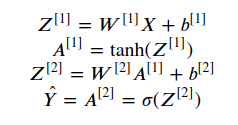

## Neural Network with one hidden layer from scratch

This is a neural network with one hidden layer to solve a binary classification problem.
The neural network is built from scratch, only using numpy and python.

### Model Achritecture
- input layer with a vector of shape (2,1)
- 1 hidden layer with 4 nodes, using tanh as activation function
- output layer with one node, using sigmoid function

### Forward Propagation

In order to compute forward propagation we compute the weighted sum and of 
the input features and add a bias, resulting in Z[1]. 
The activation function tanh is applied to each value in Z[1]. In the next the weighted sum 
of layer 2 is calculated. In the final step we pass the weighted sum of layer 2 through 
the sigmoid function. The final result indicates the probability of class 1 or 1. 0.5 is the
threshold value.
All computations are vectorized for efficient computation. This means the input X/ the weighted sum is a matrix
where the columns represent the training examples and the rows the features/ nodes. 

### Loss

Binary Cross-Entropy is used as loss function. It  quantifies the disparity between predicted values 
and actual target values in order to define how good or bad the model performs.

- m represents the number of training examples
- y[i] represents the true label
- a[2i] represents the predicted label

### Backwards propagation

Gradient decent is used to compute backwards propagation. Gradient descent calculates the 
gradients of the loss and adapts the weights and biases in every iteration by the gradients multiplied
with a certain learning rate.

The computation of the gradients is broken down into the following steps:

Gradients are updated like this:

`new_weight = old_weight - learning_rate * gradient`
